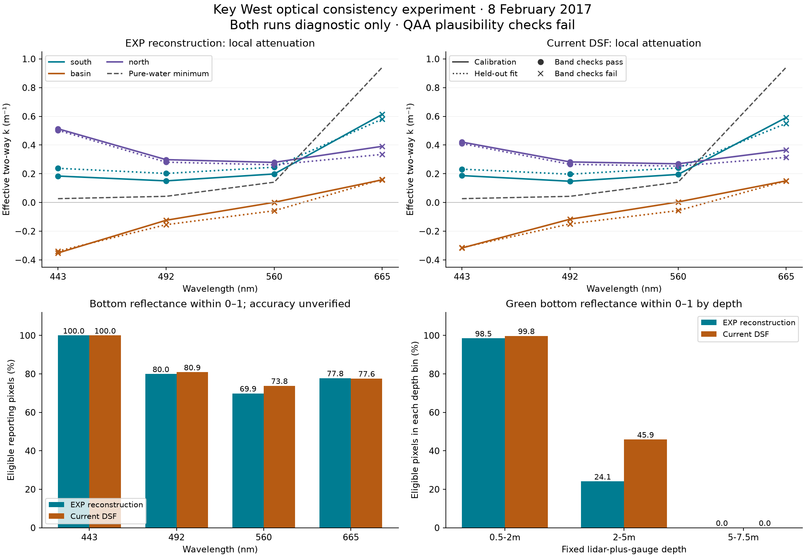

# Key West: fixed-depth optical consistency experiment

Executed **2026-09-15**. **Both atmospheric-correction variants completed, but
neither establishes trustworthy attenuation or bottom reflectance.** Southern and
northern blue/green attenuation fits pass individual band checks. The central
basin fails, every local red fit violates the pure-water minimum, and the QAA
water-optics estimates fail the library's backscatter plausibility screen.

This tests the optical components using surveyed depth, following the
[successful SDB component experiment](key-west-reference.md). It supplies useful
failure evidence without requiring a new field campaign. It does not measure
optical accuracy against independent observations. All products remain
`diagnostic_only`, `accepted: false`.



## What ran

The [frozen registration](../../benchmarks/coastal-beta/key-west-optics-v1/experiment.json)
defines two atmospheric corrections, three local attenuation regions, two offshore
reference patches and fixed perturbation scenarios. It was registered before
the optical retrievals. Thresholds and regions were not adjusted after the results.

| Input or stage | Configuration |
|---|---|
| Sentinel-2 | Same Key West acquisition as the SDB experiment; tile sensing time **2017-02-08 16:16:20.341857 UTC** |
| Atmospheric correction | ACOLITE commit `64a02ff386e2985eef68ae00198b38e04f3c4a1f`; EXP recipe reconstruction and current DSF |
| EXP | NIR 865 / SWIR 1600 nm, fixed epsilon 1, scene-mean geometry; the previously documented upstream EXP geometry limitation remains |
| DSF | Tiled aerosol estimate, intercept spectrum, percentile 1 |
| Common AC settings | 10 m grid, both `rhos` and `Rrs` exports; residual glint correction disabled |
| Processing extent | WGS84 west/south/east/north `[-81.79, 24.33, -81.70, 24.71]`, expanded offshore |
| Reporting area | EPSG:6346 bounds `[423000, 2715000, 426000, 2731000]`, 3 × 16 km; depth 0.5–7.5 m |
| Reporting depth | NOAA lidar transferred to MLLW, then acquisition-time gauge level added; no SDB fit or depth blending |
| Offshore depth | ETOPO2022, used only to screen water deeper than 100 m |
| Reference sampling | Fixed west/east offshore polygons; 5,000 samples each, seed 42; pooled case has 10,000 |
| Attenuation evaluation | Buffered 500 m checkerboard blocks; no source bathymetry cells shared between opposing splits |
| Fit window | 1–7.5 m, 0.5 m bins, existing band-specific noise/censoring/support checks |
| Products | Attenuation diagnostics at 443–865 nm; effective bottom reflectance at 443, 492, 560 and 665 nm |

The original shallow ACOLITE crop lacked a suitable deep reference. Both ACOLITE
variants were rerun over the larger extent. Extent-dependent aerosol estimation
can change reflectance relative to the earlier SDB experiment; its numerical
results must not be treated as coming from these new rasters.

### Depth, datum and reference quality

Verified six-minute observations from NOAA station **8724580, Key West**, interpolate
to **+0.2802146 m above MLLW** at tile sensing time. Instantaneous water depth is
`-lidar_elevation_MLLW + gauge_level_MLLW`. The downloaded response, query parameters,
station metadata and interpolation are preserved. Missing lidar remains nodata.
See the [NOAA water-level API](https://api.tidesandcurrents.noaa.gov/api/prod/) and
the earlier [lidar/datum preparation](key-west-reference.md#reference-and-processing-recipe).

The offshore reference samples have median coarse depth **202 m**, with a
5th–95th percentile range of **178–223 m**. They also pass the existing optical-depth
proxy and cloud/glint/adjacency masks. ETOPO elevations use **EGM2008**, not MLLW;
they never enter the shallow depth calculation. This use follows the
[ETOPO2022 datum metadata](https://www.ncei.noaa.gov/access/metadata/landing-page/bin/iso?id=gov.noaa.ngdc.mgg.dem%3Aetopo_2022%3Bview%3Diso).

Being deep and passing masks does not establish that offshore water represents
the shallow lagoon. The gauge's spatial representativeness, survey age, datum
transformation and local depth error remain unquantified. The prescribed ±0.25 m
depth perturbations are sensitivity scenarios, not confidence intervals.

## Attenuation results

The table reports **effective two-way k in m⁻¹**, fitted to `rhos` minus the offshore
reference. These values are not the downwelling `Kd` used by the QAA/Lee pathway.
Each cell shows **calibration / held-out fit** for the pooled reference.

| Region and correction | 443 nm | 492 nm | 560 nm | 665 nm | Individual visible-band checks |
|---|---:|---:|---:|---:|---|
| South, EXP | 0.184 / 0.238 | 0.151 / 0.202 | 0.199 / 0.246 | 0.614 / 0.581 | 3/4 pass; red below minimum |
| South, DSF | 0.187 / 0.232 | 0.148 / 0.197 | 0.195 / 0.241 | 0.592 / 0.551 | 3/4 pass; red below minimum |
| Basin, EXP | −0.351 / −0.339 | −0.124 / −0.155 | 0.001 / −0.058 | 0.158 / 0.161 | 0/4 pass |
| Basin, DSF | −0.317 / −0.314 | −0.116 / −0.149 | 0.004 / −0.056 | 0.151 / 0.151 | 0/4 pass |
| North, EXP | 0.514 / 0.503 | 0.298 / 0.281 | 0.279 / 0.262 | 0.391 / 0.335 | 3/4 pass; red below minimum |
| North, DSF | 0.421 / 0.410 | 0.283 / 0.266 | 0.270 / 0.253 | 0.366 / 0.315 | 3/4 pass; red below minimum |

There are **6 passing individual visible-band fits out of 12 per correction**;
the held-out fits have the same pass/fail pattern. This is a fit diagnostic, not
six validated attenuation measurements. Every regional multi-band verdict fails.
The southern 443/560 ratio is additionally flagged as near unity. The red minimum
is approximately **0.942 m⁻¹** at this solar angle: even a high-R² red regression
does not establish measured attenuation.

The whole-reporting fit hides the basin failure behind passing blue/green fits.
This supports retaining explicit local regions. Southern calibration/held-out
differences also show spatial variability; a checkerboard split does not prove
independence of water properties or substrate. Terrain classes are geometry
proxies, with no demonstrated common substrate composition.

Opaque bands above 700 nm remain negative controls. No pure-water floor claim is
made for them because the library's water table ends at 700 nm. Their correlations
must not be interpreted as useful bottom sensing.

Offshore red-band scatter supplies a noise proxy of **0.000479 rhos (EXP)** and
**0.000520 (DSF)**. Noise within the reporting regions was not independently measured.
Offset diagnostics are retained without subtracting a uniform offset; such a
subtraction would cancel from the empirical residual against the same reference.

## Bottom-reflectance results

The inversion uses **fixed lidar-plus-gauge depth and QAA-derived water optics**.
The empirical attenuation fits above do not drive this product. Both variants
select the 665 nm QAA reference and fail the existing `bbp_555_implausible` screen:
**0.02488 m⁻¹ (EXP)** and **0.02158 m⁻¹ (DSF)**. Both offshore patches fail separately
as well. This is a failed library plausibility check, not proof that these
backscatter values are impossible under every water condition.

Pooled QAA `Kd` at 443/492/560/665 nm is **0.365/0.370/0.550/0.627 m⁻¹ (EXP)** and
**0.337/0.334/0.438/0.618 m⁻¹ (DSF)**. The full empirical/QAA comparison is preserved
in the results with the QAA validity flags.

| Band | EXP: finite / within 0–1 | DSF: finite / within 0–1 | EXP / DSF median retained reflectance |
|---|---:|---:|---:|
| 443 nm | 100.0% / 100.0% | 100.0% / 100.0% | 0.165 / 0.164 |
| 492 nm | 82.4% / 80.0% | 87.3% / 80.9% | 0.220 / 0.228 |
| 560 nm | 73.9% / 69.9% | 77.6% / 73.8% | 0.379 / 0.356 |
| 665 nm | 79.3% / 77.8% | 79.2% / 77.6% | 0.222 / 0.244 |

Denominators are **326,983 eligible reporting pixels (EXP)** and **331,452 (DSF)**,
after optical masks and the 0.5–7.5 m depth restriction. The original rectangle has
480,000 pixels, including 473,208 covered by lidar. These percentages therefore
do not describe accepted coverage over the full requested rectangle. Values
rounding to 100.0% can still include a small number of rejected pixels.

The inversion retains some diagnostic values outside the physical reflectance
range; finite coverage must not be called physically valid coverage. At green,
**13,061 EXP** and **12,452 DSF** retained pixels exceed 1. Neither correction retains
any green or red bottom reflectance at **5–7.5 m**. At 2–5 m, finite green coverage
is only **47.3% (EXP)** and **73.8% (DSF)**, and some of those values also exceed 1.

Forward/inverse closure is close to floating-point precision. That checks that
the implemented equations undo one another; it supplies no independent evidence
that retrieved bottom reflectance is correct. Increasing reflectance with depth
within the flat-terrain class is another diagnostic, confounded by unmeasured
substrate changes and selective rejection of deeper pixels.

### Sensitivity of green bottom reflectance

Median absolute change on pixels finite in both the baseline and each scenario:

| Scenario | EXP | DSF |
|---|---:|---:|
| Depth −0.25 m | 0.074 | 0.056 |
| Depth +0.25 m | 0.091 | 0.066 |
| Non-water absorption/backscatter ×0.8 | 0.058 | 0.044 |
| Non-water absorption/backscatter ×1.2 | 0.063 | 0.047 |
| West offshore patch instead of pooled | 0.013 | 0.011 |
| East offshore patch instead of pooled | 0.014 | 0.012 |

Pure-water absorption and backscatter are held fixed in the water-optics scenarios.
The common-pixel population changes across scenarios; missing alternative estimates
are not silently assigned zero. Full counts and 5th/95th percentiles accompany the
summary. These perturbations do not represent measured errors or calibrated
uncertainty. Agreement between reference patches does not validate either patch.

## What this changes about the next step

1. **Audit the reference spectra and atmospheric correction before trusting QAA.**
   Both corrections leave an offshore NIR residual of about 0.003 rhos and produce
   the same QAA warning. Register a controlled spectral/glint sensitivity experiment
   with independently checked QAA equations. Keep the failing baseline. Do not
   assume the warning proves a code defect or select parameters solely to remove it.
2. **Test local water and substrate assumptions.** The basin failure occurs with
   surveyed depth, so fixing SDB cannot resolve it. Review local spectral/depth-bin
   support and existing substrate information before defining another experiment.
   New region selections informed by these results need fresh held-out evaluation.
3. **Keep the successful SDB work separate and usable.** The configurable blue/red
   recipe can still be integrated and compared at Sesimbra using the supplied
   campaign inputs. Optical failures here do not erase its measured depth results.

The present evidence does not isolate atmospheric residuals, different offshore
and lagoon water, substrate-depth covariation or model applicability as the single
cause. A new field campaign is not required to perform these next diagnostics.
Independent optical observations remain necessary for an eventual optical
accuracy claim. Detectability and seabed PAR were not validated by this experiment.

## Artifacts, verification and reproduction

- [Portable numerical summary](key-west-optics-results.json) and
  [comparison figure](assets/key-west-optics.png).
- [EXP configuration](../../benchmarks/coastal-beta/key-west-optics-v1/exp_published.json),
  [DSF configuration](../../benchmarks/coastal-beta/key-west-optics-v1/dsf_current.json)
  and [158-file input lock](../../benchmarks/coastal-beta/key-west-optics-v1/input-lock.json).
- [Input acquisition](../../scripts/coastal/key_west_optics_inputs.py),
  [optical runner](../../scripts/coastal/run_key_west_optics.py) and
  [verification/summary script](../../scripts/coastal/summarize_key_west_optics.py).
- Full local results: `out/coastal-beta/key-west-optics-v1/{exp_published,dsf_current}/`;
  each contains 26 COG rasters, fit/bin-support JSON, configuration and a final
  completion manifest. Input caches and full rasters are not committed artifacts.

Verification: **150 tests passed, 1 existing unexpected pass** across the two
Key West test modules and attenuation, QAA, Lee inversion, masks, floors and terrain.
This includes six new optical-runner checks. Required Ruff rules `E,F,I,UP` pass
for the new scripts and tests. The broader installation matrix was not rerun for
this experiment. All **52 output rasters** were checked against manifest hashes,
COG layout and diagnostic/QAA metadata. Saved reflectance statistics were recomputed;
fixed-depth values, missingness and source-cell split separation were checked.
Both the **158-file optical lock** and original **238-file SDB lock** still verify.

From the repository root, verify the existing experiment and rebuild the portable
summary/plot with a coastal environment that includes Matplotlib:

```bash
PYTHONPATH=. python scripts/coastal/summarize_key_west_optics.py
```

For a fresh reproduction, first follow the earlier SDB experiment's
[scene and lidar preparation](key-west-reference.md#artifacts-and-reproduction).
Acquire the additional public inputs and prepare each expanded ACOLITE variant:

```bash
PYTHONPATH=. python scripts/coastal/key_west_optics_inputs.py \
  .cache/coastal/reference/key-west-optics-v1/inputs

PYTHONPATH=. python scripts/coastal/prepare_key_west_acolite.py \
  --registration benchmarks/coastal-beta/key-west-optics-v1/experiment.json \
  --scene-manifest .cache/coastal/reference/key-west-2017/scene/scene-manifest.json \
  --acolite-path /path/to/pinned/acolite --python /path/to/acolite/python \
  --variant exp_published \
  --output .cache/coastal/reference/key-west-optics-v1/acolite/exp_published
```

Repeat atmospheric correction with `--variant dsf_current` and its separate output
directory. Register new output/configuration paths and a new input lock before
retrieval; the existing absolute-path lock records this executed workspace and
must be preserved. The runner's commands are:

```bash
PYTHONPATH=. python scripts/coastal/run_key_west_optics.py freeze \
  path/to/new/exp_published.json path/to/new/dsf_current.json \
  --output path/to/new/input-lock.json
PYTHONPATH=. python scripts/coastal/run_key_west_optics.py run \
  path/to/new/exp_published.json path/to/new/dsf_current.json
```

Input acquisition reuses its completed cache. ACOLITE preparation and optical
retrieval require empty output directories. A completion manifest is written only
after all required optical
outputs finish and the frozen inputs have been checked again. This component
experiment does not emit a full processor STAC collection or certify a release.
