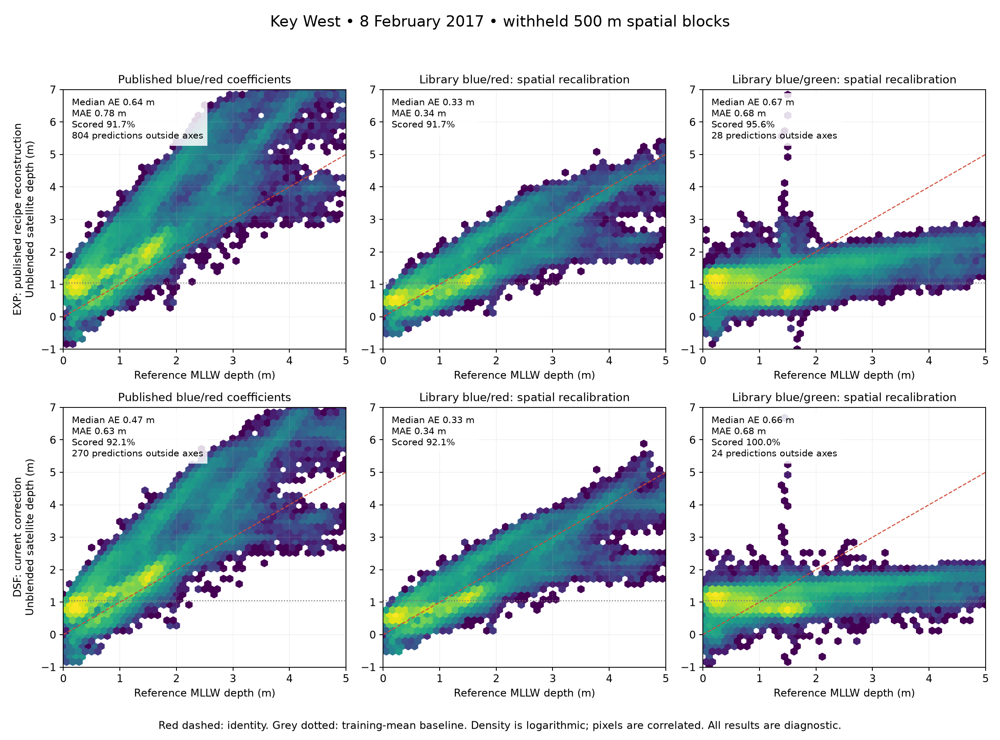

# Key West: published Sentinel-2 reference experiment

Executed **2026-09-15**. **The library retrieves useful bathymetric structure on
this published successful Sentinel-2 case.** Spatially calibrated blue/red
retrievals achieved about **0.35 m MAE**, compared with **0.68 m** for the current
blue/green component configuration. This establishes a useful SDB reference test.
Its scope is one scene, one coastal strip and a correlated lidar reference.

This is a reconstruction. Applying the paper's coefficients unchanged did **not**
reproduce its reported error. The calibrated results below use withheld spatial
blocks from the public lidar, with different calibration and evaluation areas from
the authors. They do not establish a validated five-product scientific beta.

The subsequent [fixed-depth optical experiment](key-west-optics.md) has also run
under both atmospheric corrections. It finds useful local attenuation diagnostics
but fails the checks needed to trust bottom reflectance. It uses expanded
atmospheric-correction rasters; the frozen SDB results below remain unchanged.

A [subsequent bathymetry benchmark](key-west-replication.md) evaluates nine-point
and 10,000-point calibration on fresh adjacent regions. It records the remaining
chart-replication gaps and tests improvements at matched calibration counts.

## Results

Depths are relative to **mean lower low water (MLLW)**. Metrics score unblended
satellite depths on the same fixed 160,173 evaluation pixels with reference depths
strictly between 0 and 5 m. Each model's error is conditional on its finite
predictions; coverage shows how much of that requested evaluation set was scored.
Pixels are spatially correlated and are not independent soundings.

| Atmospheric correction | SDB method | MAE (m) | Median AE (m) | RMSE (m) | Bias (m) | Scored coverage |
|---|---|---:|---:|---:|---:|---:|
| Published EXP recipe reconstruction | Published blue/red coefficients | 0.780 | 0.639 | 0.992 | +0.750 | 91.7% |
| Published EXP recipe reconstruction | Library blue/red, spatial calibration | **0.345** | **0.329** | **0.418** | +0.009 | 91.7% |
| Published EXP recipe reconstruction | Library blue/red with existing ratio guards, spatial calibration | 0.339 | 0.321 | 0.416 | +0.012 | 89.6% |
| Published EXP recipe reconstruction | Library current blue/green configuration | 0.679 | 0.668 | 0.806 | +0.036 | 95.6% |
| Current DSF correction | Published blue/red coefficients | 0.626 | 0.473 | 0.819 | +0.571 | 92.1% |
| Current DSF correction | Library blue/red, spatial calibration | **0.345** | **0.334** | **0.416** | +0.008 | 92.1% |
| Current DSF correction | Library blue/red with existing ratio guards, spatial calibration | 0.343 | 0.328 | 0.417 | +0.015 | 90.7% |
| Current DSF correction | Library current blue/green configuration | 0.684 | 0.661 | 0.838 | +0.024 | 100.0% |
| Both | Constant training-mean depth, 1.048 m | 0.674 | 0.603 | 0.869 | +0.028 | 100.0% |

The constant baseline's MAE is **0.663 m on each blue/red model's own support**.
The approximately 0.345 m blue/red result therefore reflects improvement over the
baseline on matching pixels. On the blue/green support the corresponding baseline
errors are 0.666 m (EXP) and 0.674 m (DSF). Blue/green performs slightly worse in
MAE, although its RMSE improves modestly. On support shared by all seven recorded
models, blue/red MAE remains 0.343 m (EXP) and 0.345 m (DSF).



### Errors increase in the deeper part of this subset

| Reference depth | Requested evaluation pixels | EXP blue/red MAE (m) | DSF blue/red MAE (m) |
|---|---:|---:|---:|
| 0–1 m | 91,833 | 0.285 | 0.291 |
| 1–2 m | 52,634 | 0.377 | 0.378 |
| 2–3 m | 9,319 | 0.604 | 0.533 |
| 3–4 m | 4,204 | 0.506 | 0.456 |
| 4–5 m | 2,183 | 0.735 | 0.840 |

These rows describe the spatially calibrated blue/red models without the
production blue/green ratio restrictions. Approximately 90% of the requested
evaluation pixels are shallower than 2 m. At 4–5 m only 1,812 pixels are scored
under either correction (83.0% coverage); mean bias is approximately −0.69 m.
The aggregate 0.35 m result must not become an accuracy claim for every depth.

## What this resolves

1. **The Stumpf calculation agrees with an independently coded equation.**
   Maximum absolute ratio disagreement is below 1.2e-7 on identical finite
   samples. The observed failure of the current configuration is not explained
   by an incorrect logarithm or coefficient sign in the core function.
2. **A supported configuration retrieves substantial depth variation.** The
   blue/red prediction's 5th–95th percentile span is about 92–93% of the reference
   span on the same pixels. Blue/green retains only 34–47%. A nearly constant
   depth map can have deceptively small error in a mostly shallow area.
3. **Ratio guards need band-specific treatment.** They discard
   3,324 EXP and 2,263 DSF pixels that the literal equation can evaluate. The
   guarded blue/red refits achieve about 0.34 m aggregate MAE, but at 4–5 m retain
   only 19.8% (EXP) and 22.5% (DSF) of requested pixels. Their errors on that
   remaining deeper stratum reach 1.94 and 1.86 m MAE, respectively. The current
   blue/green ratio interval should not be transferred unchanged to a blue/red
   product. Coverage loss must accompany every error statistic.
4. **Atmospheric correction alone does not resolve the current configuration.**
   The two corrections give similar calibrated blue/red errors and weak blue/green
   performance. This comparison changes band pair, reflectance scaling and
   filtering together; it does not isolate the contribution of each choice.

The next implementation step is to expose the band pair, reflectance convention,
ratio scale and preprocessing in the shared SDB stage. Use this frozen case as
a regression benchmark, then preregister a shallow Sesimbra comparison using the
supplied campaign inputs. Select model settings using calibration observations;
reserve fresh evaluation data for generalization claims. The existing Sesimbra
campaigns remain useful and do not need to be duplicated to run this work.

## Reference and processing recipe

Caballero & Stumpf (2019) report a Key West Sentinel-2 acquisition on 8 February
2017, chart calibration and airborne-lidar evaluation. Their blue/red equation
uses `depth = 5.8 * ln(1000 * Rrs_blue) / ln(1000 * Rrs_red) - 5.9`, after a
3×3 median filter, with a reported median absolute error of 0.39 m. Exact chart
point coordinates and a machine-readable evaluation polygon were not located.
[Open paper](https://repository.library.noaa.gov/view/noaa/22109/noaa_22109_DS1.pdf).

The companion study specifies the NIR/SWIR 865/1600 nm correction and maritime
epsilon of 1. These determine the registered EXP settings.
[Companion methods](https://www.mdpi.com/2072-4292/11/6/645).

- **Image:** `S2A_MSIL1C_20170208T160411_N0500_R097_T17RMH_20231024T232642.SAFE`;
  the 449,048,298-byte archive was downloaded, CRC-checked and SHA256-pinned.
  This is processing baseline 05.00, reprocessed after the paper.
  [Copernicus catalogue record](https://catalogue.dataspace.copernicus.eu/odata/v1/Products(14bf0974-868d-429d-b506-a9cbe6ada92f)).
- **Reference:** NOAA's 1 m Key West topobathymetric DEM 6366, from the April
  2016 survey. Its delivered elevations use NAVD88/GEOID12B. The DEM already
  interpolates classified ground and seabed returns; our preparation adds no gap
  filling. The provider's CRS tag and horizontal lineage differ, and its
  instrument label differs from the paper. Both discrepancies remain recorded.
  [NOAA DEM catalogue](https://www.fisheries.noaa.gov/inport/item/48372).
- **Spatial support:** a 3 km × 16 km strip along the published transects,
  EPSG:6346 bounds `[423000,2715000,426000,2731000]`. Arithmetic averaging requires
  all 100 native 1 m cells in a 10 m reference pixel. Of 480,000 requested cells,
  473,208 have complete support; 341,579 fall between 0 and 5 m after correction.
- **Datum:** 35 valid NOAA VDatum control points, one unsupported land point
  retained explicitly, and one independent interpolation check. Spatial offsets
  of +0.377 to +0.698 m convert NAVD88 elevation to MLLW elevation. All valid
  reference cells survive conversion. The API returns 0.077 m uncertainty; its
  confidence level is not inferred. This is a datum conversion, not an estimate
  of acquisition-time water level. [VDatum service](https://www.vdatum.noaa.gov/docs/services.html).
- **Calibration:** fixed 500 m checkerboard blocks, excluding one boundary pixel
  from each partition. Median-filter neighborhoods and native reference cells
  are separated across calibration and evaluation. Fits use 154,152 requested
  calibration pixels before reflectance exclusions. The adaptive ratio scale is
  estimated from calibration reflectances only.
- **ACOLITE:** clean commit `64a02ff386e2985eef68ae00198b38e04f3c4a1f`.
  EXP's default per-pixel geometry path failed with `KeyError: pressure`; the
  registered workaround uses scene-mean geometry. Current DSF retains its normal
  geometry configuration. Full resolved settings and rasters are archived.

MLLW evaluation scores chart-datum depth. The empirical intercept absorbs
scene-specific water-level effects; it does not provide an independently
validated instantaneous water-column depth for optical inversion. Survey age,
DEM interpolation, registration uncertainty and residual spatial dependence limit
the interpretation. No complete error budget or confidence interval is claimed.

## Artifacts and reproduction

- [Frozen experiment](../../benchmarks/coastal-beta/key-west-v2/experiment.json),
  [EXP configuration](../../benchmarks/coastal-beta/key-west-v2/exp_published.json),
  [DSF configuration](../../benchmarks/coastal-beta/key-west-v2/dsf_current.json),
  and [238-file input lock](../../benchmarks/coastal-beta/key-west-v2/input-lock.json).
- [Portable metrics](key-west-results.json) and [comparison figure](assets/key-west-reference.png).
- Full [EXP outputs](../../out/coastal-beta/key-west-v2/exp_published/results.json)
  and [DSF outputs](../../out/coastal-beta/key-west-v2/dsf_current/results.json):
  seven model variants, depth strata, common-support scores, rasters, evaluation
  samples, software/input hashes and completion manifests.

The initial 3×3 km basin subset reached only 2.037 m MLLW depth. It was extended
using reference-depth support and published geography **before any satellite
prediction scoring**. V1 registrations and cached inputs remain available. V2
fixes the larger region; no region or model was selected using its test errors.

Run from the repository root in an environment with coastal raster dependencies.
The acquisition helper additionally needs `requests` and `python-dotenv`; the
figure exporter needs `matplotlib`. ACOLITE runs in its separately installed
environment. On this workspace those environments are `/tmp/coastal-beta-clean`
and `/Users/andrei/kelp_observe/.venv`, respectively.

To rerun the existing frozen experiment, move the finished **entire output
directory** to an archive location first, or create a new registration with new
output paths and a fresh lock. Nonempty output directories are refused.

```bash
PYTHONPATH=. python scripts/coastal/run_key_west_reference.py \
  benchmarks/coastal-beta/key-west-v2/exp_published.json
PYTHONPATH=. python scripts/coastal/run_key_west_reference.py \
  benchmarks/coastal-beta/key-west-v2/dsf_current.json
python scripts/coastal/summarize_key_west_reference.py \
  out/coastal-beta/key-west-v2/exp_published/results.json \
  out/coastal-beta/key-west-v2/dsf_current/results.json \
  --output docs/coastal/key-west-results.json \
  --figure docs/coastal/assets/key-west-reference.png
```

For a fresh workspace, use new cache/output paths in copies of the configurations:

```bash
PYTHONPATH=. python scripts/coastal/fetch_key_west_scene.py \
  --output .cache/coastal/reference/key-west-2017/scene --env-file /path/to/.env
python scripts/coastal/prepare_key_west_lidar.py \
  --output .cache/coastal/reference/key-west-2017/lidar-transect \
  --bounds 423000 2715000 426000 2731000
python scripts/coastal/key_west_vdatum.py prepare --source-geoid geoid12b \
  --bounds 423000 2715000 426000 2731000 --grid-shape 9 4 \
  --cache-dir .cache/coastal/reference/key-west-2017/datum-transect
python scripts/coastal/key_west_vdatum.py apply --source-geoid geoid12b \
  --source .cache/coastal/reference/key-west-2017/lidar-transect/elevation_navd88_10m.tif \
  --output .cache/coastal/reference/key-west-2017/lidar-transect/elevation_mllw_10m.tif \
  --cache-dir .cache/coastal/reference/key-west-2017/datum-transect
```

For each `exp_published` and `dsf_current` variant, run
`prepare_key_west_acolite.py --registration .../experiment.json --scene-manifest
.../scene/scene-manifest.json --acolite-path /path/to/acolite --python
/path/to/acolite/python --variant VARIANT --output EMPTY_DIRECTORY`. Archive the
paper and provenance paths referenced by the configurations. Set `input_lock` in
both configurations, then freeze before running:

```bash
python scripts/coastal/freeze_key_west_reference.py EXP_CONFIG.json DSF_CONFIG.json \
  --cache .cache/coastal/reference/key-west-2017 --output NEW_INPUT_LOCK.json
```

Frozen locks use absolute paths and pin current code and input bytes. A different
workspace or regenerated ACOLITE metadata requires its own lock. Successful
execution returns zero with `status: diagnostic_only`; execution failures are
nonzero and cannot produce a completed experiment manifest.

## Verification

- **39 focused runner and Stumpf tests passed**, including masked neighborhoods,
  shared-cell split exclusion, reference holes, failed writes, reruns and changed
  frozen inputs.
- Required Ruff checks (`E,F,I,UP`) passed for all new experiment scripts/tests.
- Both runs completed; every input, code snapshot, output raster and manifest is
  checksum-addressed. Datum sign, grid alignment, masks and summary metrics were
  independently checked.

The full coastal suite and wheel-install matrix were not rerun for these
experiment-only additions. Previous checks remain in [beta status](beta-status.md).
