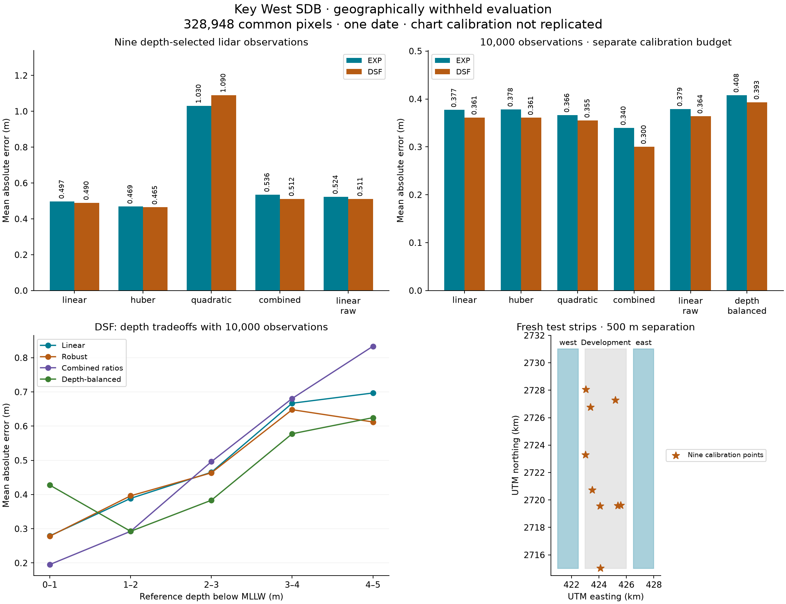

# Key West bathymetry: replication and improvement benchmark

Executed **2026-09-16**. **All 24 registered models completed on fresh geographical
test areas.** Robust fitting improves the nine-observation baseline modestly.
With a separate 10,000-observation calibration budget, combined band ratios improve
aggregate error substantially, with important depth and regional tradeoffs.

**Exact replication and superiority over the paper remain unestablished.** The
authors' nine chart-point coordinates, precise evaluation polygon and historical
processing inputs have not been recovered. The new results use a clearly labelled
lidar calibration proxy and a different test area.



## Replication audit

The [paper and NOAA repository record](https://repository.library.noaa.gov/view/noaa/22109)
provide the method and coefficients, but the inspected record supplies no separate
point-coordinate file or evaluation polygon. Table 2 specifies nine chart points
for Key West. The 490/664 nm model uses scale 5.8, offset 5.9, a logarithm scaling
constant of 1000 and 3×3 median-filtered `Rrs`. The published Key West median error
is 0.39 m, with loss of depth sensitivity beyond about 5 m.

NOAA's [historical chart archive](https://historicalcharts.noaa.gov/) returned:

- **11441, 2013, edition 42, scale 1:30,000.** The downloaded image identifies
  soundings in feet relative to MLLW, with NAD83 horizontal coordinates.
- **11442, 2012, edition 36, scale 1:80,000.** Its catalogue entry was recovered.

The chart image does not identify which soundings the authors selected. This run
does not invent those locations or silently substitute raster-digitized points.
The [source audit](../../benchmarks/coastal-beta/key-west-replication-v1/source-audit.json)
records the public searches, archive queries, source URLs and unresolved details.
No author outreach was performed.

The public [point-cloud metadata](https://www.fisheries.noaa.gov/inport/item/48174)
and [derived DEM metadata](https://www.fisheries.noaa.gov/inport/item/48372) identify
the April 19–25, 2016 Key West survey, but name a VQ820G instrument, whereas the
paper names VQ-880-G. This discrepancy remains unresolved. The current reprocessed
Sentinel image and pinned modern ACOLITE also differ from the historical workflow.

## Frozen experiment

The [registration](../../benchmarks/coastal-beta/key-west-replication-v1/experiment.json)
was written before acquiring the fresh reference strips. Their boundaries were
chosen geographically, without inspecting prediction errors. All model families
were registered before fitting. A **283-file input/code lock** was verified before
calibration and again after evaluation.

| Area | EPSG:6346 bounds, metres | Role |
|---|---|---|
| Existing central strip | `[423000,2715000,426000,2731000]` | Development/calibration; its earlier evaluation pixels are no longer treated as unseen |
| West strip | `[421000,2715000,422500,2731000]` | Fresh evaluation, 500 m from development |
| East strip | `[426500,2715000,428000,2731000]` | Fresh evaluation, 500 m from development |

The same **8 February 2017** scene and the earlier SDB experiment's frozen EXP/DSF
reflectance rasters were reused. The expanded offshore optical-experiment rasters
were not substituted. This avoids introducing another atmospheric-correction
extent change into the comparison.

Fresh lidar preparation averages complete 10×10 groups of NOAA's native 1 m DEM
cells and performs no additional gap filling. Separate 10×2 VDatum control grids
convert NAVD88/GEOID12B to MLLW. Withheld centre checks differ from interpolated
offsets by **0.0225 m west** and **0.00075 m east**. These are local interpolation
checks, not full reference error bounds. All valid source cells retain datum
support. No acquisition-time tide is added to chart-datum SDB scores.

| Coverage | West | East | Total |
|---|---:|---:|---:|
| Requested rectangle pixels | 240,000 | 240,000 | 480,000 |
| Valid reference pixels | 239,244 | 210,549 | 449,793 |
| Requested reference depths 0–5 m | 164,283 | 185,828 | **350,111** |

The shared support of all 24 models is **328,948 pixels**. Predictions outside
0–5 m remain errors; they are never clipped or removed. Coverage is reported for
each model, and comparisons also use identical finite pixels. No SDB/reference
blending occurs.

### Calibration budgets

**Nine-observation proxy:** nine lidar observations at approximately
0.5, 1, 1.5, 2, 2.5, 3, 3.5, 4 and 4.5 m, each from a different 500 m development
block. Selection uses reference depth, local terrain variation and common optical
availability, never prediction error. All compared models use the same locations.

This matches the number of fitted observations, **not the original chart source
or total information budget**. Selecting those observations uses the full
development DEM; their precision, rounding and selection uncertainty differ from
chart soundings. One fixed nine-point selection was evaluated, not an ensemble
of possible calibrations.

**Larger-data regime:** the same 10,000 seeded development observations are used
for every correction and model. Counts across successive 1 m depth bins are
5,599, 3,461, 535, 239 and 166. A separate weighted fit gives each depth bin equal
total weight, allowing the effects of depth balance to be measured.

Fitting and evaluation are separate commands. The fitting command never opens
fresh reference depths. A checksummed fit manifest seals all model parameters
before evaluation starts; changed parameters prevent evaluation. There is no
test-based selection of a production model.

## Results: nine-observation comparison

Each error cell is **median absolute error / mean absolute error, metres**.
Coverage refers to the fixed 350,111 requested 0–5 m reference pixels.

| Method | EXP median / mean | DSF median / mean | EXP / DSF coverage |
|---|---:|---:|---:|
| Published coefficients unchanged | 0.661 / 0.861 | 0.513 / 0.682 | 94.0% / 94.3% |
| Nine-point linear blue/red | 0.363 / 0.497 | 0.365 / 0.490 | 94.0% / 94.3% |
| Nine-point robust blue/red | **0.320 / 0.469** | **0.326 / 0.465** | 94.0% / 94.3% |
| Nine-point quadratic blue/red | 0.740 / 1.030 | 0.804 / 1.091 | 94.0% / 94.3% |
| Nine-point combined blue/red and blue/green ratios | 0.313 / 0.536 | 0.337 / 0.514 | 94.0% / 94.3% |
| Nine-point linear, no median filter | 0.437 / 0.521 | 0.424 / 0.509 | 95.3% / 95.5% |

The robust model uses a Huber loss with a preregistered-in-code transition scale
of 0.25 m. Its improvement over the nine-point linear model is modest but appears
under both corrections. Paired 500 m block-bootstrap 95% intervals for the change
in **mean** error are **−0.039 to −0.017 m (EXP)** and **−0.037 to −0.011 m (DSF)**.
Negative differences favour the candidate. These conditional intervals account
for block sampling, not complete model, reference or calibration uncertainty.

The nine-point quadratic fails particularly badly at 4–5 m: mean errors are
**7.67 m (EXP)** and **7.75 m (DSF)**. Those predictions and failures are retained.
The combined-ratio nine-point model lowers the median in some cases while raising
mean error. Median error alone would conceal this tradeoff.

## Results: 10,000-observation comparison

These methods have a larger calibration budget and cannot be presented as a
nine-chart-point replication. Their differences from one another use matched
calibration locations and count.

| Method | EXP median / mean | DSF median / mean | EXP / DSF coverage |
|---|---:|---:|---:|
| Linear blue/red | 0.338 / 0.377 | 0.336 / 0.362 | 94.0% / 94.3% |
| Robust blue/red | 0.331 / 0.378 | 0.329 / 0.362 | 94.0% / 94.3% |
| Quadratic blue/red | 0.326 / 0.366 | 0.325 / 0.356 | 94.0% / 94.3% |
| Combined blue/red and blue/green ratios | **0.247 / 0.340** | **0.219 / 0.302** | 94.0% / 94.3% |
| Linear, no median filter | 0.339 / 0.381 | 0.338 / 0.367 | 95.3% / 95.5% |
| Linear, equal depth-bin weight | 0.330 / 0.408 | 0.325 / 0.394 | 94.0% / 94.3% |

The combined-ratio model is a simple linear regression with two predictors and
an intercept. Against the same-budget linear blue/red model, paired block-bootstrap
95% intervals for mean-error change are **−0.059 to −0.013 m (EXP)** and
**−0.084 to −0.033 m (DSF)**. On support common to every model, mean error is
**0.340 m (EXP)** and **0.300 m (DSF)**; the improvement is not explained by dropping
additional pixels.

### Depth and regional tradeoffs remain material

About **78%** of requested evaluation pixels are shallower than 2 m. There are
only **4,628 requested pixels at 4–5 m**. The new test is geographically fresh but
still dominated by shallow water.

| DSF model | Overall mean error | 4–5 m mean error | Equal-weight mean of the five depth-bin MAEs |
|---|---:|---:|---:|
| Nine-point linear | 0.490 | 1.050 | 0.690 |
| Nine-point robust | 0.465 | 1.125 | 0.702 |
| 10,000-point linear | 0.362 | 0.699 | 0.501 |
| 10,000-point robust | 0.362 | **0.615** | 0.482 |
| 10,000-point combined ratios | **0.302** | 0.836 | 0.502 |
| 10,000-point depth-balanced | 0.394 | 0.627 | **0.463** |

The combined-ratio model's improvement is concentrated in the west: DSF mean
error changes from **0.406 to 0.267 m** there, but from **0.325 to 0.333 m** in the
east. It also worsens 4–5 m performance relative to the same-budget linear model.
Depth weighting improves the equal-depth score while increasing overall error
and positive bias. There is no universally superior candidate in this experiment.

## Interpretation and next step

1. **Replication gaps are better documented, not eliminated.** An exact
   chart-calibrated reproduction still needs the authors' observations/region or
   an explicitly reviewed chart-digitization reconstruction, plus resolution of
   source and historical-processing differences.
2. **A small robust linear model is a promising limited-calibration candidate.**
   Its modest aggregate gain holds under both corrections, but deeper-water
   error does not improve. Do not equate a lower median with success at all depths.
3. **Combined ratios deserve a separate larger-calibration experiment.** They
   improve aggregate accuracy on fresh regions at the same 10,000-observation
   budget. Their regional/depth tradeoffs must remain visible.
4. **Reserve a second date or site before selecting a production method.** These
   test results now inform model development. The next confirmation should freeze
   candidates and its selection criteria before evaluation. The supplied Sesimbra
   campaign data remain a practical next-site input; this Key West run alone does
   not establish transferable accuracy.

No production defaults were changed and no release was certified. The original
[SDB experiment](key-west-reference.md) and [optical diagnostics](key-west-optics.md)
retain their inputs and results unchanged.

## Artifacts and verification

- [Complete numerical comparison](key-west-replication-results.json), including
  every model, region, depth stratum, common-support score and paired interval.
- [Experiment registration](../../benchmarks/coastal-beta/key-west-replication-v1/experiment.json),
  [source audit](../../benchmarks/coastal-beta/key-west-replication-v1/source-audit.json)
  and [input lock](../../benchmarks/coastal-beta/key-west-replication-v1/input-lock.json).
- [Reference preparation](../../scripts/coastal/prepare_key_west_replication.py),
  [fitting/evaluation runner](../../scripts/coastal/run_key_west_replication.py)
  and [verification/plot script](../../scripts/coastal/summarize_key_west_replication.py).
- Local full artifacts: `out/coastal-beta/key-west-replication-v1/`, containing
  sealed model parameters/calibration observations, 27 COGs, scores and manifests.

**55 focused tests passed**, including ten new tests for geographical separation,
nine-point budgets, model equations, robust fitting, unclipped errors, paired
block comparisons, changed inputs and tampered sealed models. Required Ruff rules
`E,F,I,UP` pass for the new scripts/tests. Full installation and repository-wide
checks were not rerun because this change adds experiment scripts and documentation.

Verification checks all **27 rasters**, output/model checksums, COG layout,
unblended metadata, all 24 sets of saved raster-derived scores and separation of
calibration/test blocks. The earlier **238-file SDB** and **158-file optical** locks
and the new **283-file replication** lock all still verify.

### Reproduction

The runner uses the frozen earlier SDB scene/ACOLITE inputs and fixed repository
paths. Downloaded imagery, DEM/chart subsets and local rasters remain caches, not
committed data. The lock uses absolute paths and records this executed workspace.
Preserve completed experiments; register a new version for changed inputs or models.

```bash
PYTHONPATH=. python scripts/coastal/prepare_key_west_replication.py \
  benchmarks/coastal-beta/key-west-replication-v1/experiment.json \
  --output .cache/coastal/reference/key-west-replication-v1

# Initial execution only; completed locks, fits and evaluations are preserved.
PYTHONPATH=. python scripts/coastal/run_key_west_replication.py freeze
PYTHONPATH=. python scripts/coastal/run_key_west_replication.py fit
PYTHONPATH=. python scripts/coastal/run_key_west_replication.py evaluate

# Recheck existing artifacts and regenerate the report/plot; requires Matplotlib.
PYTHONPATH=. python scripts/coastal/summarize_key_west_replication.py
```
