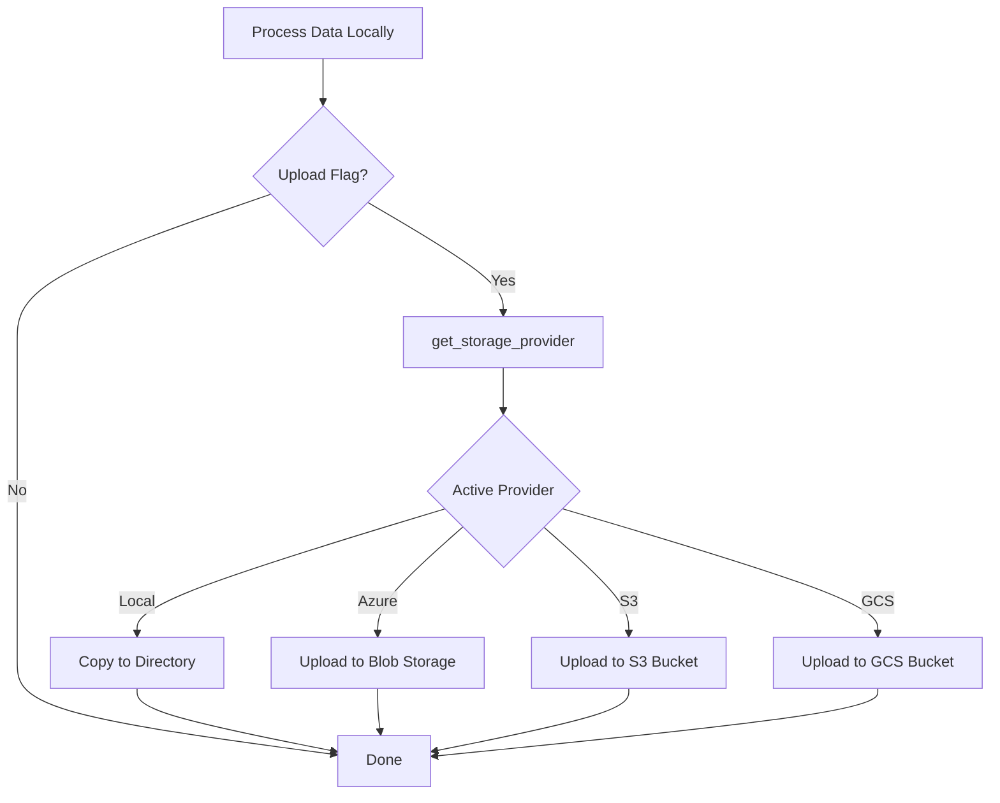
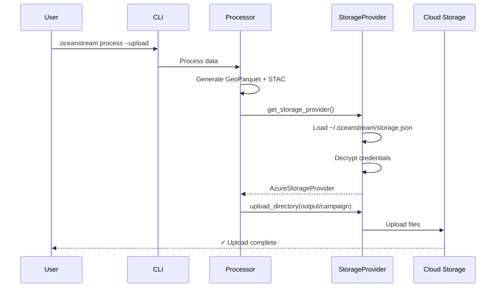

# Cloud Storage Integration

OceanStream features a unified storage provider system that allows you to seamlessly upload processed data to multiple cloud storage backends or local destinations.

## Overview

The storage provider system connects your securely stored credentials with actual data uploads, providing a consistent interface across different storage backends.



## Key Features

- **Unified Interface**: Same API for all storage backends
- **Secure Credentials**: Encrypted storage with machine-specific keys
- **Multiple Providers**: Support for Local, Azure, S3, GCS
- **Easy Switching**: Change active provider with single command
- **Automatic Upload**: Integrate seamlessly with processing pipeline

## Supported Storage Backends

### ✅ Local Storage

Copy output to local filesystem (network drives, mounted volumes).

**Use Cases**:
- Development environments
- Network-attached storage (NAS)
- NFS/SMB mounted shares
- Local backup before cloud upload

**Configuration**:
```bash
oceanstream configure storage \
  --provider local \
  --base-path /mnt/oceanstream-data
```

### ✅ Azure Blob Storage

Upload to Microsoft Azure Blob Storage containers.

**Use Cases**:
- Production cloud storage
- Multi-region replication
- Integration with Azure services
- Cost-effective archival (Cool/Archive tiers)

**Configuration**:
```bash
oceanstream configure storage \
  --provider azure \
  --connection-string "DefaultEndpointsProtocol=https;AccountName=myaccount;AccountKey=xxx;..." \
  --container-name oceanstream-data
```

**Authentication Options**:
- Connection string (recommended)
- Account name + account key
- Account name + SAS token

### 🚧 AWS S3 (Coming Soon)

Upload to Amazon S3 buckets.

**Planned Features**:
- IAM role support
- Multi-region buckets
- S3 Intelligent-Tiering
- Server-side encryption

### 🚧 Google Cloud Storage (Coming Soon)

Upload to Google Cloud Storage buckets.

**Planned Features**:
- Service account authentication
- Multi-region buckets
- Storage classes
- Lifecycle management

## How It Works

### Architecture

The storage system has two layers:

1. **Configuration Layer**: Securely stores credentials
   - Location: `~/.oceanstream/storage.json`
   - Encryption: Fernet with machine-specific key
   - Permissions: `600` (user read/write only)

2. **Provider Layer**: Abstracts storage operations
   - `StorageProvider` - Abstract base class
   - `LocalStorageProvider` - Filesystem operations
   - `AzureStorageProvider` - Azure Blob client
   - `S3StorageProvider` - Coming soon
   - `GCSStorageProvider` - Coming soon

### Data Flow



## Quick Start

### 1. Configure Storage

Choose and configure your storage provider:

```bash
# Azure
oceanstream configure storage \
  --provider azure \
  --connection-string "DefaultEndpointsProtocol=https;AccountName=myaccount;AccountKey=xxx..." \
  --container-name oceanstream-data

# Local
oceanstream configure storage \
  --provider local \
  --base-path /mnt/storage
```

### 2. Process with Upload

Add the `--upload` flag to any processing command:

```bash
oceanstream process geotrack \
  --input-source ./data/cruise_2024.csv \
  --output-dir ./output \
  --campaign-id cruise_2024 \
  --upload
```

The data will be:
1. Processed locally into `./output/cruise_2024/`
2. Automatically uploaded to your active storage provider
3. Organized with the same structure in cloud storage

### 3. Verify Upload

Check that your data arrived:

```bash
# Azure
az storage blob list \
  --account-name myaccount \
  --container-name oceanstream-data \
  --prefix cruise_2024/

# Local
ls -R /mnt/storage/cruise_2024/
```

## Advanced Usage

### Multiple Environments

Configure different providers for different environments:

```bash
# Development
oceanstream configure storage \
  --provider local \
  --base-path ./dev-output

# Staging
oceanstream configure storage \
  --provider azure-staging \
  --connection-string "..." \
  --container-name staging-data

# Production
oceanstream configure storage \
  --provider azure-prod \
  --connection-string "..." \
  --container-name production-data
```

Switch between environments:

```bash
# Use local for testing
oceanstream configure storage --set-active local
oceanstream process geotrack ... --upload

# Deploy to production
oceanstream configure storage --set-active azure-prod
oceanstream process geotrack ... --upload
```

### Programmatic Usage

Use the storage providers directly in your Python code:

```python
from pathlib import Path
from oceanstream.storage.providers import get_storage_provider

# Get active provider
provider = get_storage_provider()

# Upload single file
provider.upload_file(
    Path("output/campaign/data.parquet"),
    "campaign/lat_bin=10/lon_bin=-126/data.parquet"
)

# Upload entire directory
provider.upload_directory(
    Path("output/campaign"),
    "campaign"
)

# List uploaded files
files = provider.list_files("campaign/")
for file in files:
    print(file)
```

### Specific Provider

Use a specific provider instead of the active one:

```python
from oceanstream.storage.providers import get_storage_provider
from oceanstream.storage.manager import load_storage_configuration

config = load_storage_configuration()

# Use azure-prod even if local is active
provider = get_storage_provider(
    provider_name="azure-prod",
    config=config
)
provider.upload_directory(Path("output/campaign"), "campaign")
```

### Custom Provider Configuration

Create providers programmatically:

```python
from oceanstream.storage.providers import AzureStorageProvider
from oceanstream.storage.config import AzureStorageConfig

# Create Azure provider
config = AzureStorageConfig(
    connection_string="...",
    container_name="research-data"
)
provider = AzureStorageProvider(config)

# Upload
provider.upload_file(Path("data.parquet"), "experiment/data.parquet")
```

## Security Best Practices

### Credential Management

✅ **DO**:
- Use `oceanstream configure storage` to store credentials
- Keep credentials out of git repositories
- Use least-privilege access (container-level permissions)
- Rotate credentials regularly
- Use IAM roles when running in cloud environments

❌ **DON'T**:
- Hardcode credentials in code
- Share credentials in chat/email
- Use account-level permissions
- Commit `.env` files with credentials

### File Permissions

The storage configuration files are protected:

```bash
# Verify permissions
ls -la ~/.oceanstream/
# drwx------  storage.json (600)
# -rw-------  .storage_key (600)
```

If permissions are incorrect, fix them:

```bash
chmod 600 ~/.oceanstream/storage.json
chmod 600 ~/.oceanstream/.storage_key
```

### Encryption Details

- **Algorithm**: Fernet (symmetric encryption)
- **Key Source**: Machine-specific key in `~/.oceanstream/.storage_key`
- **Key Generation**: Random 32-byte key, base64-encoded
- **Encrypted Fields**: Connection strings, account keys, SAS tokens

Example encrypted configuration:

```json
{
  "version": "1.0",
  "active_provider": "azure",
  "providers": {
    "azure": "gAAAAABh8x9y_encrypted_data_here..."
  }
}
```

## Managing Configurations

### List All Providers

```bash
oceanstream configure storage --list
```

Output:
```
Active provider: azure
Available providers:
  - local (inactive)
  - azure (active)
  - azure-staging (inactive)
```

### Show Configuration

```bash
oceanstream configure storage --show
```

Output:
```json
{
  "active_provider": "azure",
  "providers": {
    "azure": {
      "provider": "azure",
      "container_name": "oceanstream-data",
      "has_credentials": true
    },
    "local": {
      "provider": "local",
      "base_path": "/mnt/storage"
    }
  }
}
```

### Update Provider

Reconfigure by using the same provider name:

```bash
oceanstream configure storage \
  --provider azure \
  --connection-string "new_connection_string" \
  --container-name new-container
```

### Remove Provider

```bash
oceanstream configure storage --remove azure-staging
```

## Troubleshooting

### "No active provider configured"

**Problem**: No storage provider is set as active.

**Solution**:
```bash
# Configure a provider (automatically becomes active)
oceanstream configure storage --provider azure ...

# Or set an existing one as active
oceanstream configure storage --set-active azure
```

### "Unable to authenticate"

**Problem**: Invalid credentials or expired tokens.

**Solutions**:

1. **Verify credentials**:
   ```bash
   # Azure - test connection
   az storage container list --connection-string "YOUR_CONNECTION_STRING"
   ```

2. **Reconfigure**:
   ```bash
   oceanstream configure storage --provider azure ...
   ```

3. **Check SAS token expiration**:
   - SAS tokens have expiration dates
   - Generate new token in Azure Portal

### "Container does not exist"

**Problem**: Target container hasn't been created.

**Solution**:
```bash
# Azure - create container
az storage container create \
  --name oceanstream-data \
  --connection-string "YOUR_CONNECTION_STRING"
```

### Permission errors on config files

**Problem**: Incorrect file permissions.

**Solution**:
```bash
chmod 600 ~/.oceanstream/storage.json
chmod 600 ~/.oceanstream/.storage_key
```

### Upload hangs or times out

**Problem**: Network issues or large files.

**Solutions**:

1. **Check network connectivity**
2. **Verify firewall settings**
3. **For large uploads, consider**:
   - Splitting into smaller batches
   - Using Azure Storage Explorer for manual upload
   - Checking available bandwidth

## Performance Considerations

### Parallel Uploads

For large campaigns with many files, uploads happen sequentially by default. To improve performance:

**Future Enhancement** (not yet implemented):
```python
provider.upload_directory(
    Path("output/campaign"),
    "campaign",
    max_workers=10  # Parallel uploads
)
```

### Bandwidth Optimization

**Tips**:
- Compress data before upload (GeoParquet is already compressed)
- Upload during off-peak hours
- Use regional storage (same region as processing)
- Consider Azure ExpressRoute for very large datasets

### Cost Optimization

**Azure**:
- Use Cool tier for infrequent access (`--access-tier Cool`)
- Use Archive tier for long-term storage
- Enable lifecycle management
- Monitor storage usage with Azure Cost Management

**S3** (when implemented):
- Use Intelligent-Tiering
- Enable S3 Glacier for archival
- Use S3 Storage Lens

## Integration with Processing Pipeline

### Automatic Upload After Processing

```bash
oceanstream process geotrack \
  --input-source ./data/ \
  --output-dir ./output \
  --campaign-id cruise_2024 \
  --upload
```

This will:
1. Process all CSV files in `./data/`
2. Generate GeoParquet + STAC in `./output/cruise_2024/`
3. Upload everything to active storage provider
4. Keep local copy in `./output/`

### Hybrid Storage Strategy

Keep local copies + upload to cloud:

```bash
# Process and keep local
oceanstream process geotrack \
  --input-source ./data/ \
  --output-dir ./local-backup \
  --campaign-id cruise_2024

# Then manually upload
provider = get_storage_provider()
provider.upload_directory(
    Path("./local-backup/cruise_2024"),
    "cruise_2024"
)
```

## Migration from Legacy Code

### Old Pattern (Environment Variables)

```python
# ❌ Deprecated
import os
from oceanstream.storage.azure_blob import upload_to_azure_blob

connection_string = os.getenv("AZURE_STORAGE_CONNECTION_STRING")
upload_to_azure_blob(file_path, blob_name, connection_string)
```

### New Pattern (Storage Providers)

```python
# ✅ Recommended
from oceanstream.storage.providers import get_storage_provider

provider = get_storage_provider()
provider.upload_file(file_path, blob_name)
```

### Migration Steps

1. **Configure storage** (one-time):
   ```bash
   oceanstream configure storage --provider azure ...
   ```

2. **Update code** to use providers:
   ```python
   # Replace old upload calls
   provider = get_storage_provider()
   provider.upload_file(...)
   ```

3. **Remove environment variables**:
   - Delete from `.env` files
   - Remove from environment

4. **Test thoroughly** with test data first

## Examples

### Example 1: Development → Production Pipeline

```bash
# 1. Configure both environments
oceanstream configure storage \
  --provider local \
  --base-path ./dev-output

oceanstream configure storage \
  --provider azure-prod \
  --connection-string "..." \
  --container-name production-data

# 2. Test locally
oceanstream configure storage --set-active local
oceanstream process geotrack \
  --input-source ./test_data.csv \
  --output-dir ./output \
  --campaign-id test \
  --upload

# 3. Verify local output
ls -R ./dev-output/test/

# 4. Deploy to production
oceanstream configure storage --set-active azure-prod
oceanstream process geotrack \
  --input-source ./production_data.csv \
  --output-dir ./output \
  --campaign-id cruise_2024 \
  --upload
```

### Example 2: Multi-Region Deployment

```bash
# Configure multiple Azure regions
oceanstream configure storage \
  --provider azure-us-west \
  --connection-string "..." \
  --container-name data-us-west

oceanstream configure storage \
  --provider azure-eu-west \
  --connection-string "..." \
  --container-name data-eu-west

# Upload to both regions
for region in azure-us-west azure-eu-west; do
  oceanstream configure storage --set-active $region
  oceanstream process geotrack ... --upload
done
```

### Example 3: Jupyter Notebook Workflow

```python
# Configure in notebook
from oceanstream.storage.manager import add_azure_storage
from oceanstream.storage.config import AzureStorageConfig

config = AzureStorageConfig(
    connection_string="...",
    container_name="research-data"
)
add_azure_storage("notebook-azure", config, set_active=True)

# Process data
from oceanstream.geotrack.processor import GeoTrackProcessor

processor = GeoTrackProcessor(
    input_source=Path("data.csv"),
    output_dir=Path("output"),
    campaign_id="experiment_01"
)
processor.process()

# Upload results
from oceanstream.storage.providers import get_storage_provider

provider = get_storage_provider()
provider.upload_directory(
    Path("output/experiment_01"),
    "experiment_01"
)

print("✓ Data processed and uploaded!")
```

## Related Documentation

- [Configuration Guide](../../getting-started/configuration.md) - Detailed configuration
<!-- TODO: Add API reference pages
- **CLI Reference** - All CLI commands
- **Python API** - Programmatic usage
-->
<!-- TODO: Add these pages
- **Architecture: Storage Providers** - System design
- **Azure Integration** - Azure-specific details
-->

## Future Enhancements

### Planned Features

- **S3 Support**: Full AWS S3 integration with IAM roles
- **GCS Support**: Google Cloud Storage with service accounts
- **Progress Tracking**: Real-time upload progress bars
- **Parallel Uploads**: Concurrent file uploads for speed
- **Bandwidth Limiting**: Control upload speed
- **Checksums**: Verify data integrity after upload
- **Resume Failed Uploads**: Retry logic for interrupted transfers
- **Metadata Tagging**: Add custom metadata to uploaded files

### Coming Soon

- **Upload-only mode**: Skip local processing, direct to cloud
- **Sync command**: Bidirectional synchronization
- **Backup/restore**: Archive and restore campaigns
- **Multi-provider upload**: Upload to multiple providers simultaneously

---

**Status**: ✅ Fully Implemented (Local, Azure) | 🚧 Coming Soon (S3, GCS)

**Tests**: 44 tests passing (7 provider tests + 37 config tests)

**Version**: Pre-1.0 (Active Development)
